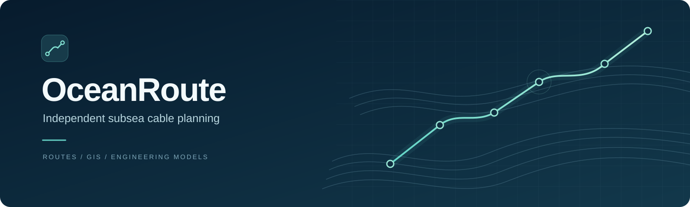
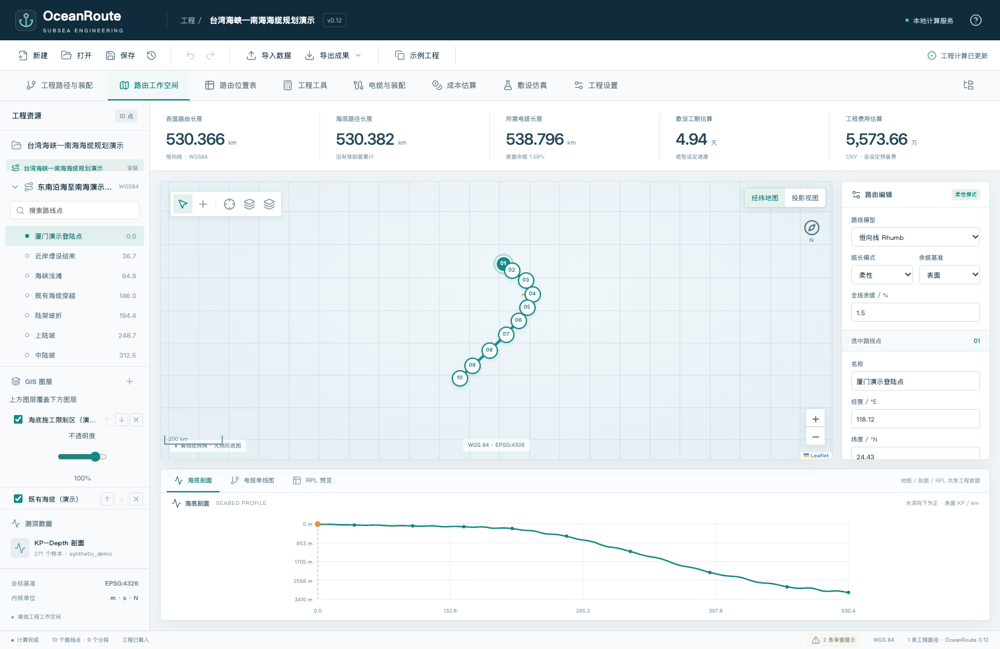
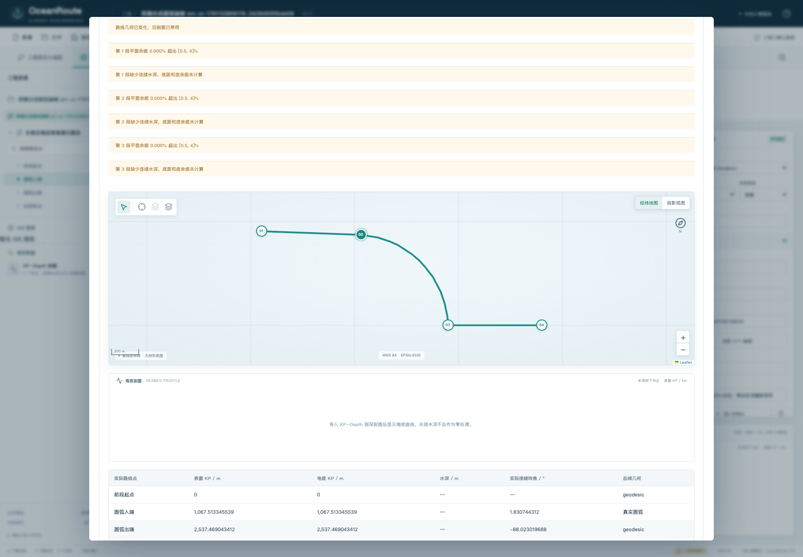
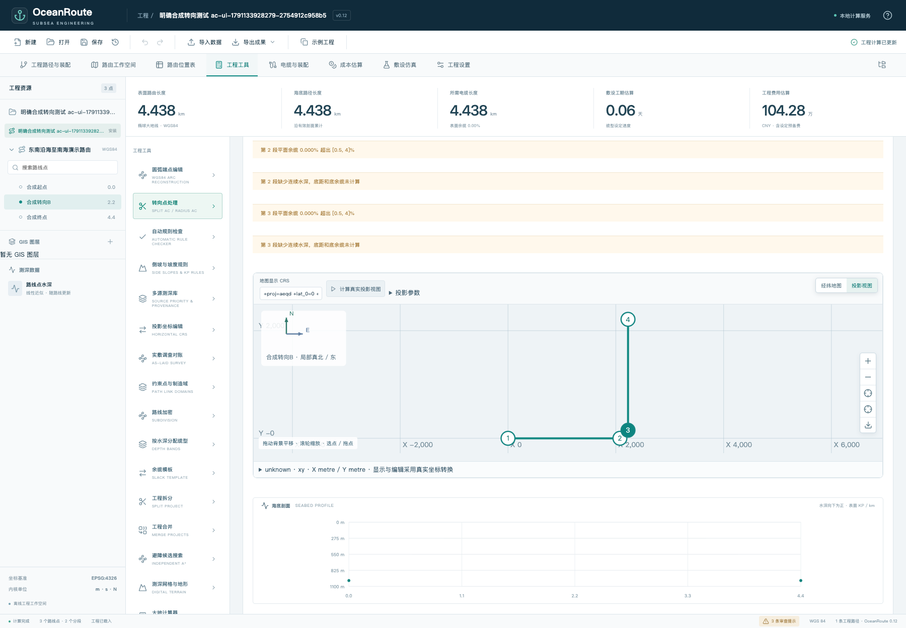
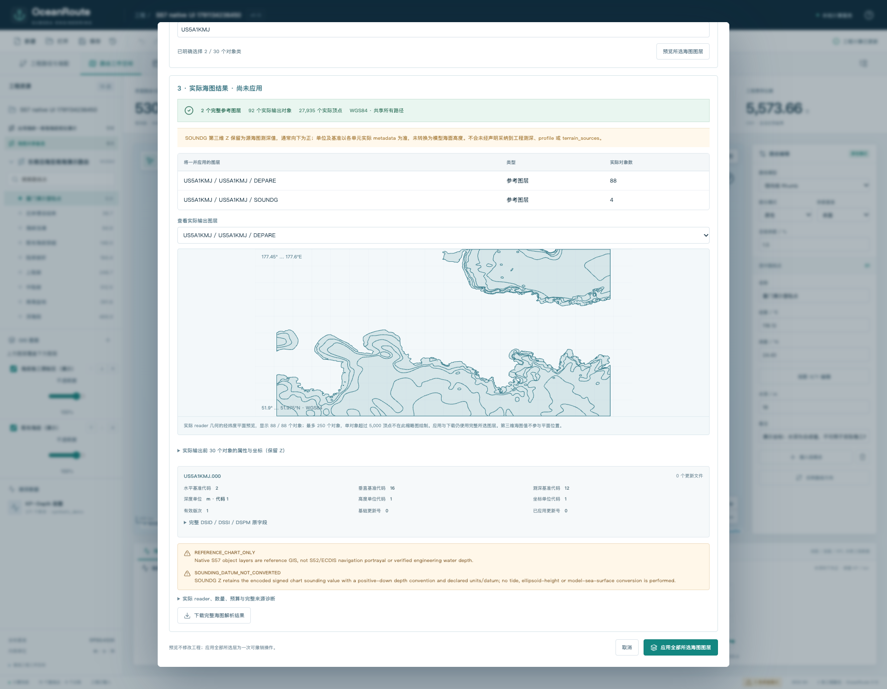
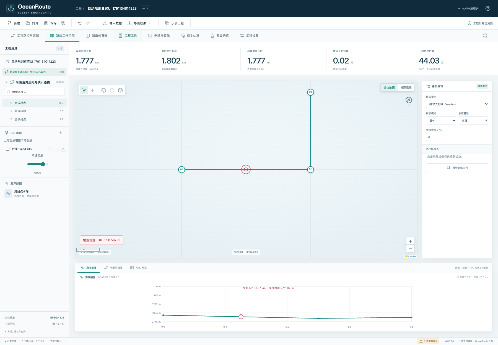
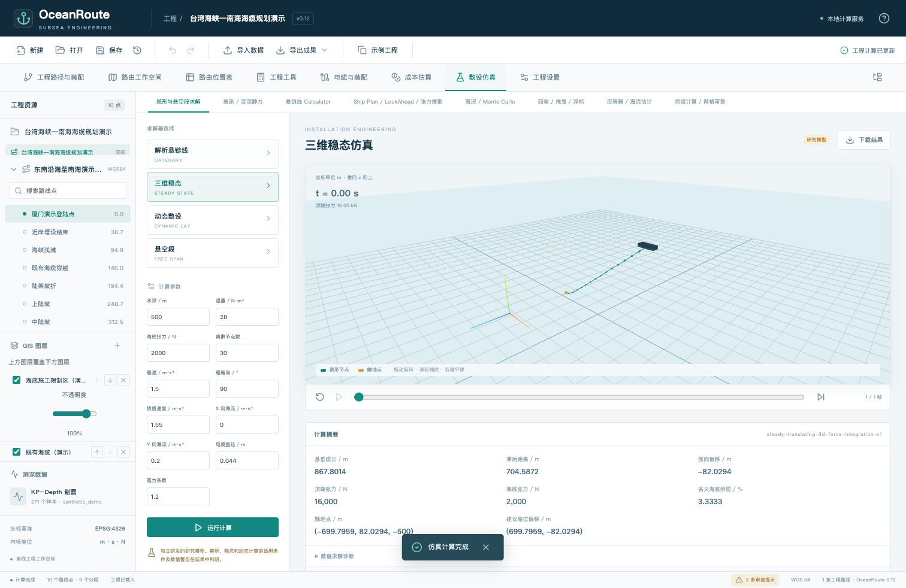

# openOceanRoute · Independent submarine cable route planning



[](https://github.com/Jane-o-O-o-O/openOceanRoute/releases/tag/v0.12.1)
[](LICENSE)
[](docs/WINDOWS_INSTALL.md)

**[Project website](https://jane-o-o-o-o.github.io/openOceanRoute/) · [Downloads](https://github.com/Jane-o-O-o-O/openOceanRoute/releases) · [Manual](docs/USER_MANUAL.md) · [Design](docs/DESIGN.md) · [中文](README.md)**

openOceanRoute is an independent MIT-licensed project for submarine cable route planning. Its application and distribution files are named **OceanRoute**, with frozen delivery version **0.12.1**. A local browser workspace connects WGS84 route geometry, true circular arcs, route position lists (RPL), bathymetry, GIS reference layers, rule checks and bounded cable mechanics research models.

**MakaiPlan / MakaiPlan Pro are Makai commercial products. This project has no affiliation, authorization or endorsement from Makai and supplies no Makai license.** It makes no claim of original-engine equivalence, proprietary format compatibility or field accuracy. MIT covers original project code and documentation; third-party components and data retain their own licenses. Read the [disclaimer](DISCLAIMER.md) and [third-party notices](NOTICE.md).

## Download 0.12.1

| Distribution | Requirements |
| --- | --- |
| [Windows x64 installer](https://github.com/Jane-o-O-o-O/openOceanRoute/releases/download/v0.12.1/OceanRoute-0.12.1-Windows-x64-Setup.exe) | About 80 MiB. Target: Windows 10 / 11 Intel / AMD 64-bit. Bundled Python and production dependencies; offline installation |
| [Portable source ZIP](https://github.com/Jane-o-O-o-O/openOceanRoute/releases/download/v0.12.1/OceanRoute-0.12.1-portable.zip) | Includes the compiled interface. Launcher requires Python 3.10+ and internet access for first dependency installation |
| [Python wheel](https://github.com/Jane-o-O-o-O/openOceanRoute/releases/download/v0.12.1/oceanroute-0.12.1-py3-none-any.whl) | Python integration; install dependencies separately |
| [User manual PDF](https://github.com/Jane-o-O-o-O/openOceanRoute/releases/download/v0.12.1/OceanRoute-0.12.1-User-Manual.pdf) / [Design PDF](https://github.com/Jane-o-O-o-O/openOceanRoute/releases/download/v0.12.1/OceanRoute-0.12.1-Design-Document.pdf) | Frozen version documents: 26 and 30 pages respectively |
| [SHA256 checksums](https://github.com/Jane-o-O-o-O/openOceanRoute/releases/download/v0.12.1/SHA256SUMS-assets-v0.12.1.txt) / [Original manifest](https://github.com/Jane-o-O-o-O/openOceanRoute/releases/download/v0.12.1/manifest-0.12.1.json) | Verify download integrity; original artifacts retain their frozen bytes |

The installer is **unsigned, and native Windows hardware acceptance has not been completed**. Existing Windows binary and installer tests ran under Wine / Rosetta. Download from this repository's Releases and verify checksums; do not disable security software to bypass warnings.

Windows data is stored in `%LOCALAPPDATA%\OceanRoute`. Closing the browser does not stop the backend; use the Start menu's OceanRoute stop entry. Uninstallation preserves user data. See [installation guidance](docs/WINDOWS_INSTALL.md).

[All 13 releases](https://github.com/Jane-o-O-o-O/openOceanRoute/releases) include the corresponding source ZIP, wheel, manual, design document and integrity files. Windows EXE distributions start at 0.12. Earlier versions are historical snapshots; **0.12 has retained known failures, so prefer 0.12.1**. GitHub-generated source archives are different from uploaded portable distributions.

## Actual workspace

The images below are unchanged copies from the 0.12.1 browser verification. They show synthetic examples and test cases, except for public NOAA chart reference data. They are not field survey results.



*Route workspace with model-based duration and cost estimates.*



*Review the complete candidate before applying and saving. This screenshot shows an unapplied candidate; stale profiles are disabled and unknown depth is not replaced with zero.*

<details>
<summary>Projected geometry, S-57, automatic rules and three-dimensional model</summary>



*Synthetic geometry example with missing continuous depth still reported.*



*S-57 object geometry and metadata are reference GIS data, not S52 / ECDIS navigation rendering or automatically validated engineering bathymetry.*



*Read-only location of a synthetic rule error; finite sampling cannot prove continuous seabed safety.*



*Independent synthetic research case, without original-vendor golden outputs or field accuracy certification.*

</details>

## Implemented scope

| Area | Implementation |
| --- | --- |
| Projects | SQLite persistence, multiple paths and shared assemblies, manufacturing relationships, fixed / flexible cable lengths and revisions |
| Route geometry | WGS84 geodesic and rhumb lines, Split AC shaping, Radius AC true arcs, geographic / projected edit candidates, explicit apply and undo |
| Planning outputs | RPL templates and import / export, maps, KP–depth profiles, straight-line diagrams, slack and duration / cost estimates |
| GIS and terrain | CRS transformations, open reference formats, native S-57 objects, XYZ / GeoTIFF, multiple sources, provenance and explicit NoData |
| Rules and search | Crossing, proximity, longitudinal / lateral slope checks, condition combinations and KP locations; finite-budget avoidance with independent review |
| Cable models | Analytical catenary, static and bounded three-dimensional steady / dynamic examples, heterogeneous segments, point loads, currents and limited seabed contact |
| Operations research | ShipPlan, LookAhead, tension search, sea-state / RAO, current inversion and partial repair workflows |

See the detailed [implementation status](docs/IMPLEMENTATION_STATUS.md) and [model notes](docs/MODEL_NOTES.md). Full vessel six-degree-of-freedom motion, lifetime fatigue, complete friction history, live vessel equipment integration and continuous seabed safety proof are outside the implemented scope.

## Recorded verification

These are **actual full-run results for the frozen 0.12.1 delivery**, not new tests performed by this documentation update. Specialized reruns are not added to the totals.

| Verification | Result |
| --- | --- |
| macOS backend | 2,232 passed; no failures, errors or skips |
| Chrome scenarios | 116 passed once each; no retries, failures or skips |
| Windows PE binaries under Wine / Rosetta | 2,231 passed; one POSIX-specific test naturally skipped; no failures or errors |
| Portable fresh installation | Full 2,232 passed; actual HTTP, analysis, persistence and reopening exercised |
| Installer under Wine / Rosetta | Upgrade, single instance, save / reopen, uninstall retaining data and reinstall payload checked |
| Visual review | 26 manual pages, 30 design pages and 117 browser screenshots reviewed |

Historical failures and fixes remain documented. Read the [stable delivery record](docs/STABLE_0.12.1.md), [release notes](docs/RELEASE_NOTES.md) and [Windows build record](docs/WINDOWS_BUILD.md). Passing tests does not establish vendor equivalence, field accuracy, navigation approval or marine engineering safety certification.

## Run a Git checkout

The installer needs no separate Python or Node.js installation. The portable ZIP includes the built interface. A Git checkout requires Python 3.10+, Node.js / npm compatible with the checked-in lockfile, and an interface build:

```bash
git clone https://github.com/Jane-o-O-o-O/openOceanRoute.git
cd openOceanRoute
python3 -m venv .venv
.venv/bin/python -m pip install -e '.[terrain]'
npm --prefix web ci
npm --prefix web run build
.venv/bin/python -m oceanroute --open
```

On Windows, first create the environment with `py -m venv .venv` (or an installed `python -m venv .venv`); then use `.venv\Scripts\python.exe` for subsequent Python commands. The source CLI defaults to local `127.0.0.1:8765`; use `--port` if that port is occupied. The installer launcher can select an available port. Source data defaults to `.oceanroute`; `OCEANROUTE_DATA_DIR` can select another directory. Do not expose this research workspace directly to the public internet.

## Documentation and community

- [User manual](docs/USER_MANUAL.md), [design](docs/DESIGN.md), [FAQ](FAQ.md) and [support](SUPPORT.md).
- [Contributing](CONTRIBUTING.md), [code of conduct](CODE_OF_CONDUCT.md), [security reporting](SECURITY.md), [Issues](https://github.com/Jane-o-O-o-O/openOceanRoute/issues) and [Discussions](https://github.com/Jane-o-O-o-O/openOceanRoute/discussions).
- [MIT license](LICENSE), [disclaimer](DISCLAIMER.md), [third-party notices](NOTICE.md), [acknowledgments](ACKNOWLEDGMENTS.md) and [citation metadata](CITATION.cff).

## Search and AI discovery

The public website includes descriptive metadata, canonical URLs, Open Graph, SoftwareApplication structured data, a sitemap and factual FAQ. [llms.txt](llms.txt), [full project text](llms-full.txt), [structured metadata](project.json) and the [release asset catalog](release-catalog.json) provide readable facts and source links.

These improve machine-readable discovery; they do not add AI search or AI route planning to the application, and do not guarantee indexing or ranking by any search engine or AI service.

## Reconstructed history

The initial 300 commits were reconstructed from frozen 0.1–0.12.1 snapshots: 140 dated August 2026 and 160 dated September 2026. Their author and committer timestamps are reconstructed dates; they were actually generated on 2026-10-07 and explicitly marked `Reconstructed-History: true`. See [the disclosure](HISTORY_RECONSTRUCTION.md). New license, website and documentation commits use their actual dates and preserve the original 300 records and frozen release artifacts.
