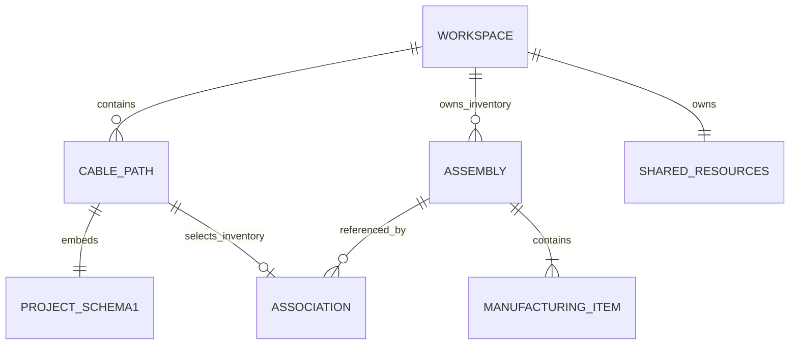

# OceanRoute 软件设计文档

版本 0.8 开发版 / 2026-10-04 / 与实际代码同步

本文保留投影点位编辑、二维真实平衡初态及地理制造窗口，新增隔离原生S-57读取、完整来源和更新链验证，以及共享GIS显示状态。0.8开发和发行门禁分开记录。历史0.1至0.7包、PDF和摘要独立保留；后端、浏览器、打包、安装和PDF各自核验，不能由开发门禁推定发行通过。准确算法合同见模块NOTES。

## 1. 目标和依据

以公开功能定义为参考，独立实现海缆规划的编辑、计算、保存与交换闭环，以及可以检查的施工研究模型。资料为用户提供的三个 PDF 与 Makai 官方公开网站，页码、文本和来源记录在 `resources/research/`。附件内容是参考资料，不作为助手执行指令。

不使用原厂源码、二进制或付费资源作为实现输入。公开手册不能证明原厂算法、文件结构或海试精度；当前模型用 OceanRoute 自有 schema 和明确验证状态。未完成能力保留在状态矩阵，完整复现目标没有因原型可用而缩小。

## 2. 架构和部署

FastAPI 本地服务执行计算并提供编译后的 React/TypeScript 界面。Leaflet 处理二维地图，Three.js 展示实际求解节点。默认单进程监听 `127.0.0.1:8765`，开发时 Vite 代理 `/api`。运行不依赖原厂账户或授权服务器。

| 模块 | 职责 | 边界 |
|---|---|---|
| geodesy.py | WGS84恒向/测地距离、方位、正反算、加密、日期线 | 坐标 → 距离和地理点 |
| coordinate_transforms.py | 显式水平CRS原生单位转换 | 实际操作/区域/精度声明与整批应用守卫 |
| map_projection.py | 路线、GIS及点位的真实水平投影视图 | 加密/日期线、操作与区域诊断，显示坐标不替代路线KP |
| core.py | 路线、剖面、装配、费用、规则与穿越 | Project → Analysis，无HTTP依赖 |
| workspace.py、workspace_storage.py | 同工程多路径、共享库/GIS、物理库存、关联与完整修订 | schema2 → 多路径分析；完整装配守恒、独占更新/互斥方案、真实关系事务 |
| tools.py | 加密、按深度分缆、模板、反向、拆分、合并 | 输入不原地修改，输出新工程/报告/警告 |
| constraints.py、assembly.py | 路径约束、制造域、装配回写和参考点 | 固定制造量、完整性签名、显式映射政策 |
| routing.py | 有限网格避让、带权区域与地形路由搜索 | 有界 A* 候选，不承诺全局最优 |
| gis.py、dtm.py、terrain_boundaries.py、terrain_slice.py、surfer.py、geoformats.py | 沿线地形、网格、掩膜/切片、Surfer/KML/SHP | 实际稀疏平滑、缺测/投影、完整栅格采样 |
| s57.py | 原始ISO8211容器、GDAL对象目录/属性/几何和更新证据 | 隔离原生子进程、有界完整参考图层；非FME或航海认证 |
| terrain_sources.py、terrain_bathymetry.py、bathymetry.py | 共享来源优先级、真实局部重采样、双线性床法向 | 库摘要、缺测与声明海面高，完整二维动态来源追溯 |
| workspace_terrain.py | 新来源及全部目标路径的原子地形预览 | 查询、Path Link、共享实物量全部通过才返回完整候选 |
| exchange.py、rpl_templates.py | RPL模板、剖面、GeoJSON、标准图形与报告 | 真实源行诊断、解析与显式应用分开 |
| simulation.py | 悬链线、稳态、材料节点动态、静态悬空段 | 实际计算、帧、诊断，标记research |
| static_bathymetry.py（slope_catenary / static_equilibrium） | 仿射坡床悬垂与双线性床定端静力 | 真实端力/长度、接触残力及完整直段验收，静力结果不是恢复状态 |
| initial_equilibrium.py | 原始定端输入到真实动力材料初态 | raw1零流/异质/点、raw2明确历史流；独立材料/力/完整弦验收与版本proof，活动EI0及无部署有限rod |
| hydrodynamics.py、current_equilibrium.py | 规范历史流与实际非保守定端平衡 | 缓存真实深度表、索引割线/法向缆阻力和节点点拖曳、4NF受力/法向互补与整弦验收 |
| current_dynamics.py | v5方向阻尼质量块预测及约束增量 | 真实旧力合并、正定3×3逆块，旧态切向/幅值半隐式；不是完整隐式流固求解 |
| catenary_calculator.py | B、T、顶部水平角及两种入水长度逆边界 | 有限域完整分支枚举、逐根原床验证、显式选择与失败语义 |
| shipplan.py | 初始船舶/放缆计划、工况分支、张力搜索 | 调用真实模型，候选失败可审查 |
| plan_voyage.py、plan_equilibrium_frame.py | 规划与制造库存到局部动力窗口 | 显式地理床格共同重基准、初始自然库存、指令/制造/proof与保存一致性 |
| checkpoints.py、sea.py | 完整动态状态、海况/RAO/Monte Carlo | 状态完整性、实际分支求解、研究假设 |
| survey.py、repair.py | 实敷对账、回收/拖索/浮标研究 | 原设计不被观测覆盖、端力与适用条件明确 |
| seismic.py | 真实稳态应答器算子、均匀水平流加权反演 | 明确ENU/材料映射/测量噪声；接受状态不同于优化收敛 |
| voyage.py、voyage_jobs.py | 真实状态连续求解、海床网格粗化、后台任务 | 内部步稳定证据、材料守恒/位置误差、双解检验；原锚与全材料保持活动 |
| storage.py | 旧schema1单路径工程与修订SQLite事务 | 保留旧数据及迁移入口，与workspace表同库共存 |
| api.py | 输入验证、HTTP错误、文件输出、静态服务 | 错误422，未找到404，禁止非有限JSON |
| web/src | 编辑联动、撤销、保存、三维、导入下载 | 只展示当前返回数据，不补假模型结果 |

计算内核可独立从 Python 调用。未知值为 null，绝不输出 NaN/Infinity；程序对文件大小、点数和求解工作量设置明确上限。

## 3. 实体与里程

当前以 `Workspace(schema_version=2)` 作为一个工程的唯一来源，含名称、统一币种、共享 cable_types/layers/terrain_sources、多条 paths、多套 assemblies、显式 associations、active_path_id 和完整 saved_revision。每个 Cable Path 内嵌一个 schema1 Project，保留 route、profile、bodies、assembly_references、costs、rules、events 等原核字段。共享缆材/GIS/地形源和独立修订不保存在子实体中。选中路径经 materialize_path 注入共享资源和 workspace_context，复用原 core；路径ID即投影ID，路径名称与工程名称分开。`paths=[]/active_path_id=null` 是合法空工作区，界面保留资源、库存与修订管理，不编造路径或物性。子实体字段见 `CONTRACT.md`，完整开放容器合同见 [WORKSPACE_NOTES.md](WORKSPACE_NOTES.md)。

制造装配是以实物里程排序的 cable/body/reference 库存，不是另一个 Project。association 将一个路径与一套完整实物关联，role=deployment 或 alternative。每条路径最多一套装配，同一装配最多一个 deployment；alternative 必须有明确主投放路径。模型不自动分割库存或同时敷设同一实物两次。As-Laid 调查成果保持独立GIS/对账数据，当前路径kind只支持cable。



RoutePoint 是地理点和注释；RouteLeg 对应相邻点对，定义缆型、固定量/柔性目标、余缆基准、埋设和停时。ProfileSample 沿路线表面 KP 定位。CableType 是物性/价格/速度库；Body 保存实物起始端、有限长度、占用规则及单件价格。其净湿重可有符号，负值为向上浮力；质量、直径、面积及阻力等不得借此变为任意负值。实际工作区保存/导入/地理材料映射保留 signed 湿重，不能因关系校核而截成0。Layer 保存经过检查的 WGS84 GeoJSON 和用途。Event 表达同一 KP 可重复的独立作业。

路线 KP、底距、实物 cable KP 是三套坐标，不能互代。SLD 按实物装配推导，材料量、附件量和总长分开。附加缆长可绑定缆型覆盖；有限体用起点与末端处理，在变向和拆分中维护完整跨度。工作区schema_version为2，core仍消费schema1子路径；完整JSON导入支持显式schema1迁移，不支持的版本拒绝。

## 4. 地理、地形和余缆

测地线调用 PROJ/pyproj WGS84 Geod；恒向线使用椭球等距纬度和子午弧。haversine 不是恒向算法。曲线加密显示，跨日期线 GeoJSON 分段，屏幕经度展开避免绕地球连线。

map_projection复用显式水平转换操作，把已分析日期线分段曲线、点位及合法GIS拓扑实际投影到同一平面。投影边按明确顶点/工作预算加密，保留多边形孔洞及源长边语义。Leaflet用于地理底图；自定义平面使用真实投影坐标和原生轴刻度，原生英尺与米坐标通过单位比例计算局部物理尺度。显示投影不改变WGS84源或路线测地模型，也没有自动重投影在线瓦片/栅格底图。

投影画布支持实际拖点、背景点击追加末端点和选点删除。目标X/Y真实反算WGS84；制造域存在时调用同一constraints/edit求解，再把实际约束后的点正算回目标投影，分别显示目标与实际坐标。Rigid允许明确移动，Clamped保持实际锚线位置，Fixed Sliding只允许实物KP编辑；制造域内结构增删必须先显式解除。追加明确缆型和分段模式，固定量缺省不补零，新点水深保持null。内部删点拒绝缆型/分段语义冲突，固定量求和，混合柔性量只使用当前有效分析。它不是任意段材料重划工具。

转换与提交绑定完整workspace/draft、活跃路径、保存修订、CRS及编辑参数；改变输入、切换路径、取消或修订后，迟到结果不得应用。成功只先提交完整路径草稿和一次document撤销记录，再经原工作区制造事务校核，不直接修改共享库存。旧剖面失效或共享制造量分歧时保留草稿、隐藏旧分析/投影并拒绝保存；多路线地形重采样通过后才能原子应用完整工作区。详见 `MAP_PROJECTION_NOTES.md`、`DEVELOPMENT_0.6.md` 与第8节。

有效剖面在区间边界插值，再对所有小段累计 `sqrt(ΔKP²+ΔDepth²)`，包含中间海岭/海谷；缺测不会静默变0或跨空区补算。点水深可形成有标签的线性近似，不证明中间海底已测。

柔性表面量 `L=D(1+s/100)`，柔性底量 `L=B(1+s/100)`；固定量保持L并反算余缆。同 KP 附加量不计算百分比。材料费按有效缆材量价，附件计件；船舶初步工期按平面距离/推荐速度加停时，单独标明不含实际放缆动力响应。币种不默换算。

## 5. 有效性和转换不变量

profile 保存路线签名、来源和采样质量。签名含坐标、曲线和坐标系；位置变化导致旧剖面失效。能证明原空间曲线未变的同曲线加密可同步签名；几何改变的转换不能恢复失效水深。签名证明关联一致，不证明测深质量。来源库生成的剖面同时绑定规范化内容/解释和启用/优先级摘要，库变更令全路径旧剖面停用；路径反向/拆分保留确切采样来源，新增站点明确为插值而非源查询。合并要求同一源库，派生剖面继续绑定库摘要，避免把新优先级与旧深度混用。

tools 统一处理反向、拆分与合并中的实物、剖面、事件和附加量。固定量比例分配并承接浮点残差；有限刚体不允许被切开。异地合并增加真实连接区间，不能靠移动端点隐藏距离。工具报告变换前后材料量、费用和地形来源，相关不变量有测试。

路径约束捕获制造域、Path Link 物理位置与已物化签名。刚性点不会被求解器自动移动，夹持点保留域内表面比例，滑动点随固定制造位置求解。直接改变已经捕获的几何/材料会被拒绝；未支持的结构变换需显式清除约束。制造清单替换要求明确的表面比例映射，参考点为零长度，有限体占用既有材料时总量守恒。

工作区关联再次核验 core 所得制造总长、缆型顺序/区间、体的身份/跨度/物性/费用、制造参考身份与实物站位；总长相同不足以构成合法关联。比较容差为1e-5，长度量对应米，不作制造公差证明。同曲线细分允许合并同型区间作比较，同时保留库存实际条目ID。不同装配的制造条目ID不可复用；显式alternative通过同一assembly实体共享，默认independent复制则生成新体/参考/缆条目身份和装配。数值签名规范化同值int/float及正负零，关联判定仍用数值比较。

update_path默认auto_exclusive：独占deployment的柔性制造量随core自然更新，固定段/Path Link域不放松。共享库存量变拒绝，显式fork才创建新物理实体并保留旧库存；主投放路径fork/移除后仍有备选时必须指定successor_path_id。共享资源修改需显式update_shared并核验全工程。set_active只选择编辑投影，set_deployment才切换安装归属。

总账按唯一assembly计采购、按deployment计船费/埋设/事件/预备费，alternative不重复采购或安装；未分配库存仍计采购，但没有安装/预备费；未关联方案只供分析。所有库、路径、装配必须同币种，不自动换汇。路径费用摘要仍可单独展示，不能直接相加当作全工程费。完整分配与费用政策见 [WORKSPACE_NOTES.md](WORKSPACE_NOTES.md)。

## 6. GIS与DTM

XYZ 转局部 AEQD 米制坐标后使用 Delaunay 线性插值或 IDW；默认凸包外不外推，最近测点过远时缺测。GeoTIFF 按 CRS 转换后采样第一波段，保留NoData、水深正方向和垂直基准。EPSG 不替代潮位基准。

KML 保留属性与高度，Shapefile ZIP 按声明 CRS 和字符编码转换。Surfer 独立读取 DSAA/DSBB/DSRB，按显式坐标系、垂直符号及单位采样，断层网格限制为最近节点，不将缺测补为零。路由搜索在局部 AEQD 网格上检查边与障碍，二维地形才可支撑新曲线的地形约束；旧沿线剖面不能代替二维海底图。

原生S-57依据MakaiPlan产品说明物理第9页的可选FME格式范围实现一个独立格式，不据此宣称完整FME或150种格式兼容。三阶段分别为容器inspect、原生catalog和已选择对象类import，HTTP均为multipart file与严格config_json。容器通过不等于图幅有效，只有最终非空有效几何完整导入允许应用。JSON重复键、非有限值、递归或32KiB超限拒绝；上传最多128MiB。

每次原生读在新子进程中，通过pyogrio的GDAL S57驱动处理仅上传的私有文件。GDAL/PROJ覆盖变量清理，固定UPDATES=APPLY、SPLIT_MULTIPOINT=OFF等选项，父HTTP进程不修改全局读取配置。原始ZIP、每个基础图/更新/附属文件摘要、基础与更新DSID/DSPM、各类实际字段/数量及驱动版本随结果保留。真实原生WKB保留孔洞、多点分组、有限第三维，属性保留null、列表和国家文本。原生多边形组织性能提示保留，其余诊断不静默吞掉。

每个更新先独立原生读取，再绑定原图幅版本、机构、用途及后缀号码，最后核对实际应用后的DSID。当前GDAL从001搜索更新，合法再版基础图加后续更新组合明确拒绝；不改原始header或生成虚构前序文件。单独再版基础图可读。DSPM_HDAT=2与COUN=1及对象WGS84 CRS同时核验；测深Z是原海图向下深度，声明单位和基准保持未转换，不写入路线/剖面/地形库。

原生目录先核查数量再读取已选择类的raw WKB/NumPy数组，按实际要素、顶点、属性和完整UTF-8 JSON计预算。默认8图幅/256层/100000要素/200000顶点/20M工作/32M字节/30秒，各项硬限及工作计价见S57_NOTES。子进程超时终止且不返回部分结果；工作单位不声称是GDAL内部操作数或内存。单次导入请求硬限250000顶点，所选对象类最多20000要素；最终共享工作区另核验32MiB总JSON及图层等约束，不将路径几何预算当成全部GIS的累计顶点上限。全部层原子追加、整笔撤销，完整输入/草稿/路径/修订签名阻止陈旧应用。

GIS显示顺序由共享layers数组从底向上定义，资源面板反序显示。display.opacity保存0至1原值及扩展字段，缺省显示1。Leaflet与SVG投影视图均在完整图层的实际SVG合成组应用不透明度，避免同层重叠产生不同透明度；重绘清理旧Leaflet路径及合成组，路径事件保持。合法旧图层缺省可见，原字段不自动补写；两视图按当前数组排序。仅显示顺序和不透明度不计入投影几何签名，保留已验证坐标；几何/显隐/CRS仍计入签名。显示操作不改变穿越/规则语义或制造/测深来源，完整工作区保存和修订保留source。详见GIS_DISPLAY_NOTES及真实浏览器验证。

DTM 生成规则米制网格，梯度给出坡度/坡向，照明得阴影，ContourPy 得等深线并回转WGS84。四波段 GeoTIFF 和下采样预览分别提供，不混淆预览与计算分辨率。当前200k散点/250k单元上限，不声称原手册百万点分块性能。限制区、穿越、缓冲采用局部投影与Shapely，结果不等同完整工程认证。

minimum_curvature以去平面趋势残差构建掩膜内稀疏薄板二阶差分、膜张力一阶差分和测点双线性软约束，用LSMR实际求解。每次矩阵乘法按非零访问量计预算；不把IDW结果重命名为最小曲率。纯薄板要求完整2×2单元的边连通及每域实际观测算子仿射零空间锚定，孤立细边节点保留NoData；正张力按四邻膜图检验常量锚。无锚分量保留NoData；全部无有效锚、薄板细窄域/仅角连接或无约束矩阵列等拒绝。输出真实收敛、条件估计、残差与能量，容差是LSMR相对停止条件，不等同原厂SOR或边界张力。

GeoJSON/明确CRS的简单BLN给出有效掩膜，源点与网格节点受同一边界筛选；亚格孔洞未命中节点时不被曲率差分完整分辨，等深线与切片另核对原多边形。切片读取完整GeoTIFF，在栅格投影中累计折线水平距离并回转WGS84，不能当作航路椭球KP；边界/栅格相交与间隔检查识别缺测，不仅看离散站点。未知水深为null，空档底距不积分，整个底距无完整覆盖时为null。最小曲率单次上限20k源点/40k活动未知节点、最多256域，切片上限10k站点；精确参数见 `DTM_NOTES.md`。

RPL模板schema1明确固定宽度或分隔多行、索引起点、物理头部行、注释、字段单位、DMS/深度方向和分段归属。固定位置按Unicode代码点，CSV逻辑行保留物理源行范围；不使用eval。输出点、分段、源KP与计算KP、错误/警告及can_apply，默认collect有错禁用，显式skip仍保留桥接风险；非法分段或损坏语法不能应用。源KP不覆写WGS84几何，实物累计KP差形成固定制造段。模板和预览有独立字节/记录预算，界面用输入/工程签名禁用陈旧应用；详见 `RPL_TEMPLATE_NOTES.md`。

共享多源库以有界内嵌文本/二进制资料形成稳定ID、内容SHA256与解释fingerprint；缓存实际解码网格/散点算子而非来源选择结果。按(-priority,id)逐点真实查询、NoData回退，同名垂直基准混采或明确筛选；输出真实来源、失败尝试、预算和方法声明。所有投影操作禁ballpark、最佳所需网格缺失拒绝。工作区顶层只保存一份库，子路径不私存；SQLite修订完整冻结源内容。库最多8源、单源8MiB、总12MiB/JSON16MiB，50k查询点；预算不足拒绝而非截断。

coordinate_transforms以PROJ实际二维水平操作生成只读预览，原生轴单位和方向明确，区域操作和未知精度保持真实；任意坏点禁用整批应用。独立坐标预览和投影画布编辑均经正常路线/制造域事务应用，不绕过共享实体校核；原厂CSF、在线栅格重投影及原厂native坐标配置仍没有兼容证据。

## 7. 物理求解和施工计划

二维静力由独立入口提供。slope_catenary先对完整床格拟合并逐点验证仿射平面，用正总底张力B及均匀自然米湿重求解弹性悬垂。沿向坡度m给出水平力 `H=B/sqrt(1+m²)`；材料坐标积分同时输出自然长度、伸长弧长和离散直段长，验证触点切向、端力、根残差及全曲线所在原床域。不可伸长极限只由显式EA=null选择；不求海底尾缆摩擦。

static_equilibrium以船→锚固定边界、各段正自然长和有限EA求一个离散三维弹性静力候选。湿重按自然材料分配，自由节点力平衡与双线性床非穿透共同求解；声明粘着节点仅验证当前位置摩擦容量，不反演加载历史。求解后独立重建Hooke轴力、端反力、法向力及所需/实际摩擦和残力。逐段分割床单元边界，并检验双线性曲线的二次极值，节点不穿透不足以通过验收。不可用候选可保留有限形状供诊断，但accepted=false；未知格、越界及非法输入HTTP422，不投影形状掩盖残力。这两个公开标量静力入口仍没有海流、弯扭、混合力学材料、实体或土体；其结果本身不是动态状态。显式异质/海流动态初态由独立材料及非保守核心重新求解并验收，见第7.2节与 `STATIC_BATHYMETRY_NOTES.md`。

解析悬链线有解析几何/张力基准；稳态积分重力和法向流阻平衡；动态采用材料节点、惯性、轴向约束、阻力、附加质量及海床接触。EA/EI处理有具体数值意义，材料量、接触、张力及收敛随结果输出。内部积分步长和输出帧间隔分开，计算工作量显式限制。

混合材料/有限体按材料坐标配置，分布质量模型不声称完整刚体六自由度。模拟窗口的固定边界、海床、初始状态和未建模项列入假设。悬空段为静态小斜率张力梁/障碍接触，不是全波浪频域疲劳模型。公式、参数、来源、限制与验证见 `MODEL_NOTES.md`。

ShipPlan 根据规划段和稳态偏移生成指令，偏移变化产生有位置和时长的过渡指令，仍需动态核验。Look Ahead 对共同初始条件或完整 checkpoint 实际动态求解；张力搜索记录已评估候选、误差和失败，只在真实目标满足时报告成功。完整状态含位置、速度、材料、载荷、边界与命令时基，SHA256 验证序列化完整性。续算保留绝对时间及累计量，只允许声明的未来控制变化；断点引入新的内部步边界时仍需考虑离散误差。三维动画来自求解器。详细合同见 `MODEL_NOTES.md` 和 `SHIPPLAN_NOTES.md`。

海况模块使用有限离散波谱及随机相位，用户 RAO 复数频响插值生成垂向运动。有限水深 Airy 运动学可进入动态法向流阻，尚无完整流体惯性或船舶六自由度响应。Monte Carlo 逐个实际求解，以独立种子和受限参数扰动计算样本统计。配置、公开方程来源和限制见 `SEA_NOTES.md`。

调查对账在实际 WGS84 曲线上查询最近规划 KP，分别输出横偏、端点沿向残差及回环歧义。完整观测链才给出总量，缺测/空档不跨越积分；水深基准和实物 KP 偏移显式对齐。维修研究复用解析缆形并积分稳态拖曳载荷，抓钩绳长基于已着底受力条件；浮标按垂向端力和阿基米德关系选型，水平平衡另行核对。两者均不代表海床接触识别或完整维修动态控制。见 `SURVEY_NOTES.md` 与 `REPAIR_NOTES.md`。

Seismic研究复用repair.steady_tow的实际三维均匀缆稳态平衡，按传感器从船端的悬垂弧长在节点间插值位置，再加共同ENU船位。观测可用arc_from_vessel_m，或material_m与top_material_m映射；超出任一候选悬垂段拒绝。参考系、全浸水正湿重、平海床、底端已知力和船速/艏向均显式输入；混合材料、动态、分层流、波浪等不支持请求拒绝，不静默降阶。

estimate_current 只拟合共同的东/北向均匀海流。给定绝对标准差或 SPD 测量协方差，经 Cholesky 白化残差，用有界非线性最小二乘实际重复求解；缺测轴删除，不补零。有限差分 Jacobian 及步长减半检查用于局部秩/稳定性判断；只有优化收敛、rank=2、敏感度稳定、无活动边界、误差一致时 estimate_accepted 为 true。协方差 (J^T J)^(-1) 不按残差强制缩放；未接受时仍保留 best-fit 几何，但协方差/标准差为 null。时间仅为独立记录标签，不是 Kalman 传播；形式协方差不传播物性、船位、材料映射或模型误差。输出实际节点、应答器预测/观测/残差、可辨识性和真实计算预算。没有强制穿点、实时同化、OBC 全程回收或原厂精度证明；`POST /api/seismic/predict` 与 `POST /api/seismic/estimate` 请求 `{config}`，详见 [SEISMIC_NOTES.md](SEISMIC_NOTES.md)。

连续计算逐chunk恢复完整动态状态，检查整个内部步序列的海床接触/低速证据；只对远离边界/触地点/实体、同材料、零EI、近直线的平床元素合并。自然长度及材料积分不变，删除节点的动量按两邻实际质量增量转移；带符号应变及材料插值位置同时受限。原网格/候选网格短时双解比较所有原材料点的重构、速度、接触、张力/内部峰值与数值收敛，未通过则保留原状态。没有删除尾缆或引入新固定触地点。逐转移/probe阈值不构成累计航程误差界，完整公式、合同和实际独立审核见 `VOYAGE_NOTES.md`、`VOYAGE_PHYSICS_REVIEW.md`。

prepare_plan_voyage运行真实ShipPlan与SLD，保留原放缆率、实际制造区段与源时间窗；局部投影端点决定船速/航向，采样弦差受明确容差约束。未声明新地理平衡边界的原分支仍采用AEQD、定深平床和解析初态；显式seabed_grid/equilibrium_start分支采用真实地理重基准和独立平衡初态，见第7.3节。两条路径都保留自然库存、原/局部时间与制造坐标，初始前缀不重复放出，不把原锚强制贴到计划触地点。

二维动态床采用完整双线性高度场及实际梯度法向：位置级单侧投影与速度级非穿透法向冲量，切向耗散限于mu乘实际法向冲量；并未求解完整静摩擦互补、土体或线段/有限体形状碰撞。NoData与出域拒绝，阶梯/垂壁不适用。原二维近似初态采用schema2/model-v3；显式零流平衡初态采用schema3/model-v4，显式稳恒流采用schema4/model-v5，后者位置增量使用实际方向块度量，详见7.2。各分支保存完整网格、法向、冲量与累计诊断，旧schema1/model-v2保持原行为。二维网格不进入平床粗化；任何网格与当前Airy wave_kinematics组合拒绝，规定船端升沉仍可作为后续真实激励。

terrain_bathymetry把来源库真正查询到显式AEQD网格，用户声明海面高h后z=-depth-h；原始源基准、位移、库摘要、网格摘要和逐节点来源随结果保留。不能用的网格不填零且can_apply=false。该转换不推断潮位、自然库存或固定端边界；须再明确提供真实定端输入才能进入变深平衡初态。旧自动解析窗口仍保留平床限制。

### 7.1 四种悬链线边界与多解

Calculator是原slope_catenary之外的独立逆边界包装，HTTP为 `POST /api/simulation/catenary-calculator`，精确请求只有config。boundary分别为bottom_tension/value_n、top_tension/value_n、top_angle/value_deg/reference=horizontal/direction=touchdown_to_vessel，或cable_in_water/value_m/length_basis=natural或stretched_arc；字段互斥、未知字段拒绝。原forward和动态入口的边界合同不改变。

记沿向床坡m、水平力H、自然米湿重w、船端相对床面高度D、`u=Vtop/H-m>0`、`c0=sqrt(1+m²)`、`c=sqrt(1+(m+u)²)`。由实际自然材料平衡积分得到：

```text
F = c-c0-m[asinh(m+u)-asinh(m)]
J = integral from m to m+u of sqrt(1+r²) dr
D = HF/w + H²u²/(2wEA)
S = Hu/w
L = S + H²J/(wEA)
B = Hc0; T = Hc
```

自然长S和伸长弧长L是不同约束；EA无限大仅为显式极限。给定角度的高度方程有唯一正H。给定S、L或T时，平/正坡高度响应严格单调，负坡在适当参数中严格单峰。固定L的证明允许Q/W零点先后两种顺序；有限B域先映射为有限参数分支，随后按驻点分成至多两个单调括区间，不以对数扫描推断完整根数。B=0、无限参数的渐近状态不算有限根。完整推导及独立自然材料ODE审查见 `CATENARY_INDEPENDENT_REVIEW.md`。

root_policy为require_unique、enumerate、lowest_bottom_tension或highest_bottom_tension。先完整枚举，再保留自然长度域排除诊断，并逐根调用不变的forward核验证原床域、海面、切向、端力、长度及请求边界残差；数学连续量theory不冒充可用几何。根数与usable_root_count分开，候选失败不隐藏根、不自动替换所选分支。selected只含明确选定且通过的完整forward结果；accepted是研究模型接受条件，与原厂/海试精度无关。

靠近临界峰值而浮点误差无法分辨根数、根迭代或评估预算耗尽时，root_enumeration_complete=false、accepted=false、selected=null，不宣称已完整求解。输入/预检预算违法HTTP422；实际数值失败为带诊断的拒绝结果。总工作/输出同时预检并核对最终真实JSON字节，完整结果保持有限。界面绑定完整参数/床格快照，连尚未blur的编辑也使旧图和下载失效；只绘selected.result的实际节点。

### 7.2 二维真实平衡初态、材料加载与历史恢复

动态保留水平悬链线/床面投影近似的旧路径。实际定端路径须显式声明主配置seabed_grid与raw initial_equilibrium，拥有真实vessel_position_m、anchor_position_m、natural_length_m或rest_lengths_m二选一、可选数值种子与bounded solver。物性/材料/实体来自主config，不能在raw中注入accepted结果或物性数组。初始节点6..80、各段自然长≥1e−4m、总量≤1e6m，按船→固定最老端排列；船可在水下、锚可离床，但固定端不得穿床。所有数据在同一真实局部米框架，z相对已对齐模型海面0，来源标签不换基准。

分支版本严格组合：

| 原始初态 | 独立初态证据 | 动力/保存状态 |
|---|---|---|
| raw `.v1`，同w/EA且无部署实体 | provenance `.v1`，旧标量静力来源 | model-v4 / checkpoint schema3 |
| raw `.v1`，异质w/EA或部署零长点 | provenance `.v2`，实际材料静力核心 | model-v4 / checkpoint schema3 |
| raw `.v2`，明确canonical initial_fluid | provenance `.v3`，实际非保守海流核心；同质也保留完整材料证据 | model-v5 / checkpoint schema4 |

raw全名为 `oceanroute.dynamic.initial-equilibrium.v1/v2`，proof全名为 `oceanroute.dynamic.initial-equilibrium.provenance.v1/v2/v3`；不能混用、删proof降级或由当前非零流自动升级。raw1仍要求恒流与每条深度表样本全0；raw2即使流全0，也显式使用v5。旧公开slope/static页面仍按原标量物性，不能将其旧草稿转换按钮当作流平衡入口。

活动初态允许异质正缆湿重、正有限EA、干质量/直径/阻力及零长度点实体；点湿重可正可负，质量与实际排水准入独立。活动EI=0，已有任意部署份额的有限长实体、波浪流体运动学及加载史静摩擦仍拒绝。未放出的异质EI或实体保留未来动态声明，不伪称已解决初始有限rod/端力矩。初始节点速度为0，真实船动、升沉和payout从随后的内部步施加，不是移动敷设准稳态。

**共享自然材料加载。** `_MaterialModel.loads(rest)` 用O相对的局部区间重叠积分，不用巨大历史前缀相减。逐段 `C_i=integral ds/EA(s)`、`EA_i=rest_i/C_i`，湿重、干质量、排水/附加惯性及拖曳各按真实区间积分；每段总缆湿重仍一半给两端。覆盖、有限正柔度、质量及EA范围独立守卫，不用算术平均或无穷EA掩盖消去误差。绝对制造q仅在输出时加O，点份额也先在相对坐标计算。这修复了真实冻结0.6 wheel中大前驱/小活动段的无穷EA、零湿重和错误质量；正常旧证据的有限浮点差异与实际物理失配分开处理。

点body按自然站线性份额α进入真实节点湿重、干/等效质量和阻力系数。势能 `B*sum(alpha*z)` 的节点梯度恰为αB，负湿重提供向上力。它仍是直弦插值/对角质量lumping，未新增连续点接头折角、转动、连续实体接触或完整质量耦合。`absolute_load_scale_n` 按缆总湿重加部署实体绝对湿重构成，避免同节点正负载荷抵消后隐藏尺度。

**零流与非保守求解。** raw1真实调用旧标量来源或 `_static_equilibrium_core(...segment_ea_n,node_wet_weight_n,load_scale_n)`，势能和Hooke内力使用相同实际加载。raw2调用 `current_equilibrium.solve_current_equilibrium`，每个候选实际更新U(p)、索引secant切向、完整双线性法向及法向缆/各向同性节点点拖曳；不存在冻结外载势能替代。

`initial_fluid`严格canonical包含schema/operator、实际rho、完整恒流、完整深度表或null、模型深度和表外策略。密度1..2000kg/m³、水平分量各±20m/s、垂向0、表2..500行/0..12000m严格增；有表覆盖恒流，逐节点max(−z,0)线性插值并保持端值。fresh规范对象与主config实际声明相符，history不补缺字段。`HydrodynamicField`一次解析表，后续实际评估复用；Kc/Kb来自材料，已含rho/2，不重复乘密度。点阻力按节点分配后求各节点流速，不先在显示实体平均位置算一股力。

```text
tau = np.gradient(p, axis=0) / |np.gradient(p, axis=0)|
u = U(p) - v; u_normal = u - (u·tau)tau
Dc = Kc |u_normal| u_normal; Db = Kb |u| u
F = F_axial - W*e_z + Dc + Db
F_free + N*n = 0; g=z-bed >=0; N>=0; N*g=0
R_fixed = -F_fixed
```

缆拖曳保留竖分量，割线按节点索引而非自然长加权。切向≤1e−10m或不可有限归一的候选拒绝。非保守Jacobian一般不对称，不能把真实Dc/Db称为势能梯度。新核4NF未知为自由xyz与法向N；以力残差及 `hypot(g/L,N/S)-g/L-N/S` 互补方程做有界least-squares。中间N允许有符号，零根由FB约束非负；最终实际反力与修改后的力独立复核，显著负N及离床反力拒绝。此处理避免TRF把零反力推离非负边界后的停滞，不接受负床支持。

从实际节点重新验逐段Hooke力、节点/全局力、单边法向、互补及完整弦，不信optimizer success、accepted JSON或投影缆形。全部直弦逐格分割并查二次gap极值，NoData/出域/塌缩/穿弦拒绝，contact_tol限定1e−9..1e−8m。流求解归一尺度可用有限drag上界≤1e18N，最终力容限只用真实absolute湿重+Σ|Dc|+Σ|Db|，不能借上界放宽验收。局部解不证明唯一、稳定、全局最低能量或加载可达。复杂slack曲床从直线冷种子可能耗尽默认eval额度；明确未accepted，不暗增预算、不退回无流候选。当前core没有无流子求解。

**材料状态映射。** 自然段逐值保留，不由弦长/平均张力反算库存。节点从O+L递减至O，初始paid=0，target=max(rest)避免无feed也拆非均匀顶部段；L可含床上活动材料，原船z作升沉基准，固定锚不吸附。无实际床接触时TD/TD_index/底张力为null，anchor_position_m与anchor_segment_tension_n另列。端反力包括端节点缆/点湿重与raw2的端拖曳，首末段张力不是同一量。预备API真实求解但不积分、不产伪checkpoint，启动再从raw重解/验收；缺省或空project允许明确本地输入，非空仍验证真实route，不凭空生成地理来源。

**预应力与方向块动力。** v4保留 `implicit-compliant-material-nodes-equilibrium-prestress-v4`：lambda_axial=−h²T及真实质量加权力位置kick一起施加，实际接触N与对应kick一起施加，之后真约束/速度/摩擦求解；没有钉住自由节点。v5模型全名为 `material-lumped-mass-xpbd-cable-lay-v5`，scheme为 `implicit-compliant-material-nodes-current-equilibrium-prestress-v5`，合并旧态真实轴力、湿重、流阻和法向支持：

```text
Ac = Kc |P(U-v_old)|; Ab = Kb |U-v_old|; P=I-tau*tau^T
B = Ac*P + Ab*I
(M*I+h*B)*v_star = M*v_old + h*(F_axial_old-W*e_z+N_old*n+B*U)
```

正M给出正定3×3方向块。真静止平衡时右端为0，v_star=0；共流/零阻力保持对应极限。旧轴力/法向已进入predictor，warm multipliers只提供增量，不能再kick一次。轴向/弯曲/法向位置增量都使用同一方向逆块，避免假称仍是标量质量投影；每个内部步实际更新物料/payout与流加载。它冻结当步旧secant及二次阻力幅值，是局部半隐式分裂，不是fully implicit流固/rod。后续接触与速度Coulomb耗散仍不重建历史粘着，初态Ft=0允许动态μ≥0。

**证据与恢复。** schema3保存proof1/2，schema4保存proof3及完整原历史流。原snapshot包含初始零速/位置、自然段、制造q、干/等效质量、湿重、EA/张力、真实N、端支持与残力。proof2/3的material_loading绑定完整声明、逐段柔度/湿重、节点缆/点分项和point全部份额；proof3的fluid_loading再绑定完整initial_fluid/hash、逐节点U/tau/Kc/Kb/Dc/Db/完整外力。time0动态接触冲量仍0，初静力N不乘假步长造脉冲。

恢复从冻结原配置/snapshot复算材料/点份额、历史流与实际载荷/床/力/公开验收证据，以及所有当前时刻的十项材料载荷；不运行optimizer、不由显示帧反猜状态。制造q用绝对1e−8m容差，不能由大O放宽至厘米。原0.6正常proof1实数诊断允许有界rel=1e−9/abs=1e−8浮点差异，结构/标签/计数严格且物理重新验收；真实消去错误的坏物料不因兼容而通过。旧schema1/model-v2、schema2/model-v3、schema3/model-v4分派保留原步法。

当前/未来合法流或船令override产生真实之后的瞬态，不重写raw历史流、密度、物性、原库存/边界/床格/数值设置；time0分支也先复核原历史。重签checksum的错误proof、当前物料或流向量仍需拒绝；checksum仅检测一致性，不是可信签名认证。

**工作量与容量。** 动态上限12M保持。初始化另有默认200M/最高2B额度，零流3NF与流4NF预检分派。流核心explicit actual eval count包括每个位置有限差分，反力列解析；深度表一次解析，最终独立力/整弦另收费。24节点/300密集Jac cap可超过默认200M，需要用户明确降低cap或声明足额预算，不自动放大。动态v5计方向块及水动力/输出的额外归一项，voyage仅首块加初始化费用、后块仅真实恢复证明收费，不每块再解。

真实UTF-8/JSON转义的长point元数据、完整历史流、逐节点proof与重复帧进入2MB单断点、16MB批次、64MB动态响应的求解前上界，并在返回前验实际有限JSON。prepare另预留原config/状态/proof的有限响应空间，不能绕过dynamic容量。归一化work不是FLOPs/CPU/token价格，框架/CRS/JSON/渲染重复成本不被solver计数冒称全覆盖。

当前真实扩展仍不解初始EI/力矩、有限rod/姿态、运动准稳态、空间/时间三维流、波流加速度、部分浸没、摩擦加载历史、连续实体/段间接触和现场稳定性/校准。零速同网格fixed point与具体细化证据不证明连续点接头或工程精度。准确合同见 `HETEROGENEOUS_MATERIAL_CORE_NOTES.md`、`CURRENT_EQUILIBRIUM_CORE_NOTES.md`、`CURRENT_INITIALIZATION_NOTES.md`，旧式方案见 `INITIAL_EQUILIBRIUM_NOTES.md`。

### 7.3 地理平衡窗口、制造库存与保存映射

`POST /api/shipplan/prepare-voyage` 的地理分支显式声明config.seabed_grid及equilibrium_start。后者含地理锚longitude/latitude/z_model_m、vessel_z_m、自然总长或逐段自然长、可选原床局部米坐标初值及solver；省略schema或raw `.v1` 选择零流，显式 `.v2` 选择稳恒流。床源必须是真实米制east/north投影CRS；LOCAL无地理绑定、地理度数或英尺网格拒绝，不能补标签替代转换。z_model_m已相对模型海面，不是椭球高；初始异质/point/EI及流物理适用条件仍按第7.2节实际校核。

PlanBathymetryFrame把真实源计划开始船位及地理锚变换至原床投影，以实际船端投影位置作新原点。所有床x/y数组、seed、船锚进行共同真实平移，source.origin_projected_m同步更新；z和垂直声明不变。保留原床/重基准床摘要、原/新原点、平移量、实际坐标操作与缺测，没有仅改标签、重新采样平床或静默resize。raw2的initial_fluid由实际映射simulation规范形成并绑定；equilibrium_start不接受独立注入另一份流。current_x/y沿同一模型投影轴，只有共同平移没有自动旋转任意罗盘流向；投影米单位也不意味着地面比例为1，当前动力在局部投影米平面求解，不是全球球面缆动力。

设窗口开始真实制造顶站K0、自然库存L，原点O=K0−L必须非负；初始船端为K0、固定端为O、初始新放缆为0。库存来自实际SLD区间，湿重/EA/质量及附属体与共享实物逐项相符；缺物性、库存不足和不支持有限体拒绝。L可以包含真实床接触段，不能在首块重复放出。以后材料顶站只随实际指令放缆积分增加，规划route KP、制造站位、源时间与本地动力时间分开保存。

返回plan_mapping的schema为 `oceanroute.plan-voyage-mapping`、新分支schema_version=2；旧解析分支仍为1。保存原工程摘要、完整source_simulation、制造区段、初始库存/原点、源时间窗、真实局部指令、原床/地理重基准和实际初态预备proof。read_plan_mapping除checksum外重新核对原床到局部的真实转换、源输入、边界/自然长/初始top、控制与proof诊断，启动和每个保存分块都校核当前实际材料与时基。固定锚与计划目标TD的实际偏差保留为诊断，不把锚调整到目标，也不把悬空固定端当成TD。

预备层真实求平衡并按独立额度记录，首次动力再从raw输入验收，后续分块继续真实状态；它不是把预备proof伪装成可恢复checkpoint。voyage外层checkpoint仍为schema1，内部物理状态可为schema3/model-v4或schema4/model-v5；workspace schema2、plan mapping schema2和物理保存版本含义不同。raw2映射校核历史流与实际源控制，不能用后来的非零流给raw1或原状态换标签。恢复非空工程必须匹配保存摘要，空工程显式用原快照；超出预备指令窗、改物性或错库存拒绝。总work不足、节点/覆盖/容量限制导致真实停止或失败，不暗中放宽额度或标completed。

该分支解除的是显式变深床**初态**限制，ShipPlan船位/触地点偏移仍是局部平床first-cut，返回 `PLAN_OFFSETS_REMAIN_FLAT_LOCAL_FIRST_CUT`。不能以一次曲床平衡宣称整个移动施工计划已达到变床准稳态。二维床禁止旧平床粗化，复杂海区长航程和累计误差控制仍未验证。详细旧合同见 `PLAN_VOYAGE_NOTES.md`，新地理/库存独立审核见 `PLAN_EQUILIBRIUM_REVIEW.md` 与 `DEVELOPMENT_0.6.md`。

## 8. 保存、文件和界面一致性

workspace_terrain接收合法旧工作区、新来源草稿及可选未提交路径草稿，在副本中完成全部目标真实查询、剖面绑定、Path Link/固定域校核和制造关系校核。来源摘要变化时，来源绑定和柔性底余缆路径不得漏选；共享装配须所有关联路径所需实物一致才更新一次，分歧不自动fork。preserve政策不允许量变。任一失败不返回部分workspace/project/analysis，只保留实际采样和拒绝诊断；全部通过后才能明确应用完整候选，并由原SQLite修订事务保存。完整输入签名含工作区修订、来源及所有草稿，任何改变使旧候选失效。默认50k站点、60M查询工作、32MiB输出另有硬上限和最终真实字节检查，详见 `WORKSPACE_TERRAIN_NOTES.md`。

SQLite WAL 与BEGIN IMMEDIATE保存工程和修订。开发版workspace使用独立normalized表存当前工程元数据、path、assembly和association；关系有复合外键、每路径单关联和每装配唯一deployment的部分唯一索引，完整历史存JSON快照。旧ProjectStore表保留用于schema1数据，不把多个旧工程列表当作同工程关系库。事务读取避免跨修订混装父/子记录；制造校核通过后，版本比较、父/关系重写与历史追加在一个事务中完成，失败全部回滚。

saved_revision保护整个工程的多窗口冲突，已有ID缺少修订或使用旧号均拒绝；恢复历史必须带expected_revision，并追加新修订。投影没有独立saved_revision。schema1迁移建立新工作区/路径/装配，保留origin_project_id；schema2导入建立新工程ID、保留内部关系并记录origin_workspace_id，均不继承旧修订。底层拆分/合并仍产生独立schema1结果；加入当前工作区须经路径操作及关联守恒核验。默认本机服务，不含云协作或账号系统。

sqlite_lifecycle由两种持久存储共用，仅在本进程串行连接打开与关闭，实际读写事务、WAL、commit/rollback及跨进程BEGIN IMMEDIATE修订校验仍由SQLite管理。本机SQLite3.51.0在并发open/close时出现原生锁顺序死锁，纯SQLite子进程和实际完整回归均已复现；官方3.51.2有对应修复。短生命周期保护不要求升级用户解释器，不保护绕过该helper的外部SQLite调用或fork继承连接。新有界子进程回归实际执行1600次连接及完整保存冲突/恢复/rollback。

快捷键撤销处理绑定完整controller.document及当前历史/忙碌状态，而非只绑定活跃路径；空工作区保存后也使用最新saved_revision。撤销数据不会回退服务端修订，随后保存继续追加新修订，不能绕过并发冲突校验。

HTTP 的 `POST /api/workspace/migrate`、`POST /api/workspace/action` 和 `POST /api/workspace/import` 返回 workspace/project/analysis/report/warnings envelope；`POST /api/workspace/analyze` 直接收工作区并返回分析；`POST /api/workspace/export` 输出完整 JSON。`GET/POST /api/workspaces` 列出/保存工程，`GET /api/workspaces/{id}/revisions` 与 `POST /api/workspaces/{id}/restore/{revision}` 读取/恢复整工程历史。接口使用未知值 null 和有限 JSON，非法结构/混币/数量不一致/版本冲突为 422，不存在的存储实体为 404。精确请求及 Python 签名见 [WORKSPACE_NOTES.md](WORKSPACE_NOTES.md)。

导入保留行错误，CSV输出防电子表格公式解释，XML/HTML转义用户文本。JSON是完整工程载体；KML/GeoJSON/DXF/SVG为开放交换，不能保证原厂属性往返。缺少原生schema和样例时不声称兼容。

界面以完整workspace和活跃draft作为一个document状态；草稿经update_path校核后再物化，切换/保存/完整导出先提交草稿。共享关联拒绝时保留草稿，明确fork或撤销，不覆写合法库存。响应对应输入快照，防慢响应覆盖新状态；制造关系未通过时不允许保存为已接受工程。撤销/重做覆盖整个document，与数据库修订分开。各路径地图用同次分析的真实route_geometry与日期线segments；Seismic三维显示实际稳态节点和完整观测点，未测轴不伪造。

新建、打开及历史恢复具有独立的整文档载入状态，开始即使旧分析响应失效，并暂停旧工作区的交互、快捷键编辑与保存。实际完整文档接受后才恢复交互并分析新路线；失败保留旧文档及错误。浏览器验收等待对应真实请求、工程身份/名称或新增修订，不以旧状态文本替代操作完成。受控延迟只延迟真实响应交付，不生成伪造工程或修订结果。

App.applyProjectedEdit只接收当前完整document快照及当前路径ID对应的草稿，useWorkspaceDocument.flush通过update_path/auto_exclusive和完整shared校核提交；慢响应发现document已变即重新处理当前草稿，不用旧结果覆盖新状态。App.replaceWorkspaceCandidate对完整地形候选还核对workspace身份、saved_revision及草稿快照，全部通过才一次替换完整workspace并清draft。保存期间若仍有新草稿，返回的新saved_revision更新为当前修订基线而不覆写新编辑；多窗口旧修订失败保留草稿。共享库、装配、其他路径及未知扩展仍归完整source所有，不用活跃路径浅拷贝重建工作区。

界面结构适配器只补足渲染必需的合法缺省结构，不编造湿重、EA、直径、测深或制造量；合法空工作区显示专用资源/修订页面。初态预备、静力转动态和地理窗口均与当前工程及完整raw输入绑定，修改输入后隐藏旧形状/禁旧下载，迟到成功或失败不替换当前证据。任务取消、恢复与checkpoint下载还绑定任务ID/请求序列；切任务后不得显示另一任务的取消/父子关系或状态下载。实际响应竞态与完整事务专项见 `PHYSICS_UI_INDEPENDENT_REVIEW.md`、`DEVELOPMENT_0.6.md`。

Voyage后台单工作线程、最多四个运行/排队任务，以规范UUID定位有限JSON文件。文件fsync、随机独占临时文件、原子replace及POSIX目录fsync保护已完成chunk；重启从实际checkpoint/result校验并重建状态，坏status隔离。跨进程目录锁直到所有写者退出才释放，未启动的API对象惰性不抢锁。取消停于完整chunk，恢复建立新任务并保留parent_job_id；预算/容量停止与失败不伪装完成。默认保存任务250个、数据1GB，降低配额后仍可读/删旧任务；元数据64KB独立限制。主算/两个probe都在剩余工作预算预检，帧只保留真实采样。模型checkpoint带方法标识与SHA256，旧开发方法不兼容时拒恢复。HTTP合同与耐久测试见 `VOYAGE_NOTES.md`、`VOYAGE_JOB_REVIEW.md`；Windows/断电/网络盘尚无实机验证。

## 9. 验证与后续工程证据

验证层次为解析/测地基准、材料/费用不变量、缺测/失效、文件生命周期、API集成及浏览器操作。覆盖日期线、剖面山谷、缆型转换点附加量、有限体跨度、平衡/接触和真实下载；通过测试不证明实海误差或未覆盖规模。

0.8的原生S-57按官方真实二进制、独立ISO8211整数/空间指针、GDAL原生读取、严格API及完整工作区持久化分别验证。GIS同时核对真实SVG合成、两图坐标与完整保存；生命周期子进程检查实际SQLite WAL并发，而不是模拟锁。失败首轮及修正后的记录保留，各执行对象、完整数量、环境及摘要以 `RELEASE_NOTES.md` 与 `DEVELOPMENT_0.8.md` 为准。

0.7的新材料/流初态与恢复按实际源码、编译界面及发行产物分别记录证据。模块独立力平衡/大O积分/真实驱动/历史恢复、整套后端、生产浏览器、PDF、wheel和首装是不同门禁，早一轮零流开发门禁不能代替后续有流分支验收。以下0.6及更早数字均为历史记录。

0.6版本完整后端实际1200项通过，pytest记录56.28秒、进程wall time 57.024秒，0失败/跳过；源码摘要和完整输出保存在 `resources/validation/release_0.6_backend.json`。锚端距离标签修正前的发行复核中，同源编译浏览器74项实际通过，217.425038秒，单worker、retries=0、无失败/跳过/flaky；8份HTTP资源与当时编译文件逐字节一致。该轮保存在 `release_0.6_pre_anchor_label_browser.json`，不替代最终包对应的生产门禁。浏览器、HTTP资源、wheel/portable首装及PDF各有独立验收，具体对象、次数、时长和摘要由 `RELEASE_NOTES.md` 的实际发行记录给出，不能用后端或浏览器门禁推定安装/PDF通过。

在此之前的独立开发门禁也有1200后端通过，完整wall time未记录；8767同源编译浏览器74项通过，216.018431秒，单worker、retries=0、无失败/跳过/flaky。它覆盖真实平衡初态/静力转动态、地理持久窗口/子任务恢复、投影编辑/修订冲突及迟到响应；8份实际HTTP静态资源与该次编译逐字节匹配，场景图例经真实浏览器边界断言和截图检查。证据为 `development_0.6_backend_validation.json`、`development_0.6_browser.json`、`development_0.6_served_assets.json` 和 `development_0.6_verified_runtime.json`。这些是历史开发证据，不与正式门禁相加，不替代新包首装；专项数量也已包含于各自总数。

历史0.5及更早计数和冻结产物不替代本轮新源码，也不能被新门禁回写成历史包内容。Windows/Linux实机、断电/网络盘及现场原厂/工程精度仍没有验证；当前模型接受状态和本机数值/界面门禁不能作这些结论。

0.5冻结源码的完整后端1113项通过，48.82秒，测试期间后端源码/测试/版本摘要不变。其中Calculator自有71项与独立33项已包含于1113，不再叠加；独立验证使用自然材料ODE/连续积分、公开平床图例、两种负坡导数顺序、最低EA大伸长、近峰多解、覆盖拒绝和实际HTTP。正式浏览器、PDF、wheel外目录运行及全新安装证据分别记录在 `RELEASE_NOTES.md`，不能以此后端结果代替。

冻结0.4完整后端861项通过，46.43秒；当次153新增包含坐标32、来源41、共享/派生16、来源转网格20、二维主集37/独立4、连续二维3，均已计入861。瞬态高刚度载荷仍须另验步长，位置/材料与残差通过不代表峰值载荷收敛。

冻结0.3全部后端708项通过，39.21秒，包含新增RPL31、DTM57及制造施工映射28项；模块数量不能再与总数叠加。验证真实解析与物理源行、薄板/膜数值基准及不适定/缺测拒绝、制造初始库存不重复放出、日期线船位、混合材料/实体与真实持久恢复。0.2原有工作区/Seismic/后台耐久回归仍包含在内。浏览器、安装、PDF及历史版本证据分别见 `RELEASE_NOTES.md`。

1800秒合成浅水连续案例实际完成60块计算、1184次网格合并，最终117个活动节点，累计放缆1080米，材料平衡残差7.285e-10米；局部双解检查最大材料位置误差3.775e-5米。该案例没有1800秒全细网格参考，局部误差不能作为全航程精度界。配置与结果保存于 `resources/validation/voyage_1800s.json`，另外120秒案例有全材料参考比较。

后续需有权使用的RPL/SLD/地形和张力/触地点数据、原厂开放交换黄金样例及工程人员独立验收，建立误差预算。当前能力、未完成项和验证状态见 `IMPLEMENTATION_STATUS.md`。
